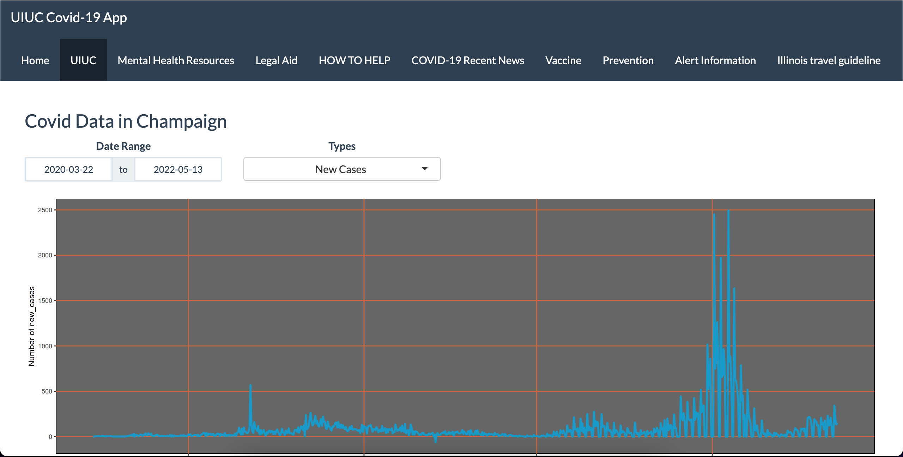

# Covid19_app

This project is built to help student in University of Illinois Urbana-Champaign by giving them supplementary information to help them guide through the pandemic"
This app has been created by using R shiny-app library.

This app can be accessed via link provided below:

https://dchung1940.shinyapps.io/covid19_project/?_ga=2.66044270.17206748.1612673346-1916962343.1612673346

Further details to the code can be seen in app.R

Some pictures may not be uploaded due to link being not updated.

